---
## Front matter
lang: ru-RU
title: Отчет по лабораторной работе №1
subtitle: Операционные системы
author:
  - БЕМБО Ж. Л., НКАбд-01-23
institute:
  - Российский университет дружбы народов, Москва, Россия
date: 16 марта 2024

## i18n babel
babel-lang: russian
babel-otherlangs: english

## Formatting pdf
toc: false
toc-title: Содержание
slide_level: 2
aspectratio: 169
section-titles: true
theme: metropolis
header-includes:
 - \metroset{progressbar=frametitle,sectionpage=progressbar,numbering=fraction}
 - '\makeatletter'
 - '\beamer@ignorenonframefalse'
 - '\makeatother'
---

## Цель работы

Целью данной работы является приобретение практических навыков установки операционной системы на виртуальную машину, настройки минимально необходимых для дальнейшей работы сервисов.

## Задание

1. Создание виртуальной машины
2. Установка операционной системы
3. Работа с операционной системой после установки
4. Установка программного обеспечения для создания документации
5. Дополнительные задания

## Создание виртуальной машины

Нажимая "создать", создаю новую виртуальную машину, указываю ее имя, путь к папке машины по умолчанию меня устраивает, выбираю тип ОС и версию (рис. @fig:001).

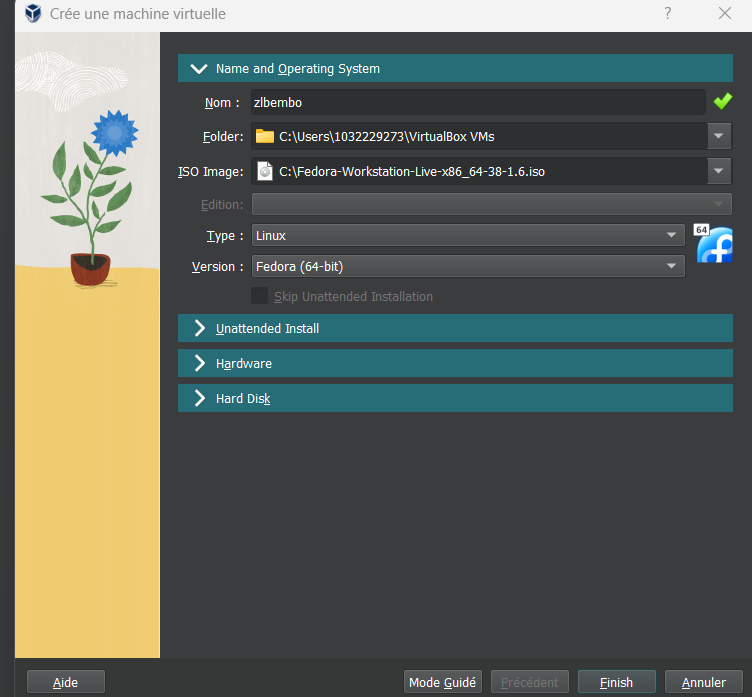{ #fig:001 width=80% }

## Создание виртуальной машины

Задаю размер диска - 103 ГБ, оставляю расположение жесткого диска по умолчанию, т. к. работаю на собственной технике и значение по умолчанию меня устраивает (рис. @fig:002).

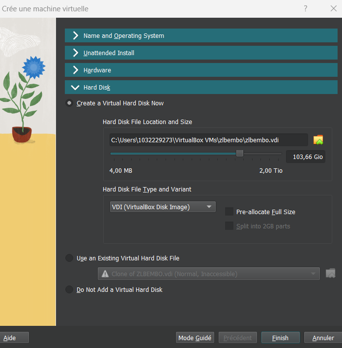{ #fig:002 width=80% }

## Установка операционной системы

Запускаю созданную виртуальную машину для установки (рис. @fig:003).

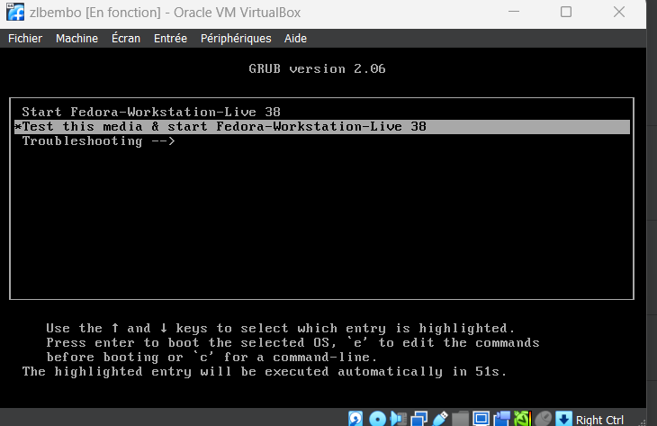{ #fig:003 width=80% }

## Установка операционной системы

Далее операционная система устанавливается. После установки нажимаю "завершить установку" (рис. @fig:004).

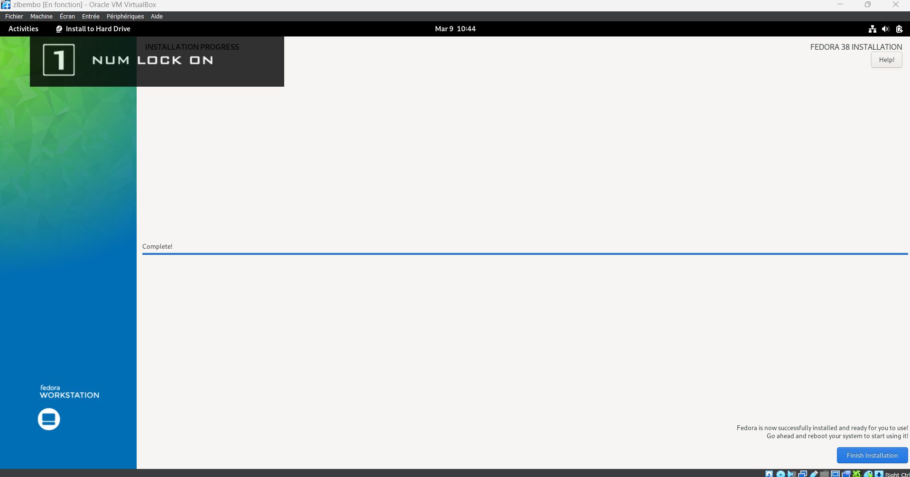{ #fig:004 width=80% }

## Установка операционной системы

Создаю пользователя, добавляю административные привилегии для этой учетной записи, чтобы я могла свободно выполнять команды как супер-пользователь (рис. @fig:005).

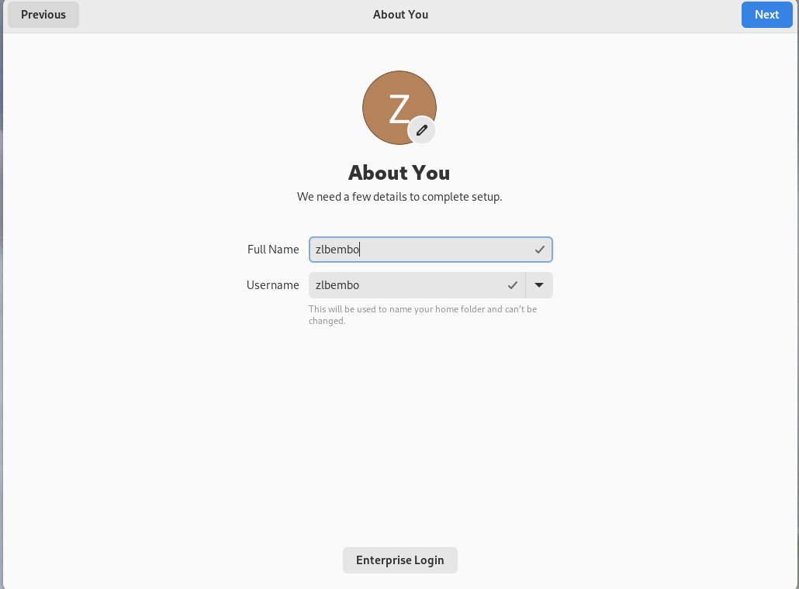{#fig:005 width=70%}

## Установка операционной системы

Создаю аккаунт администратора и создаю пароль для супер-пользователя (рис. @fig:006).

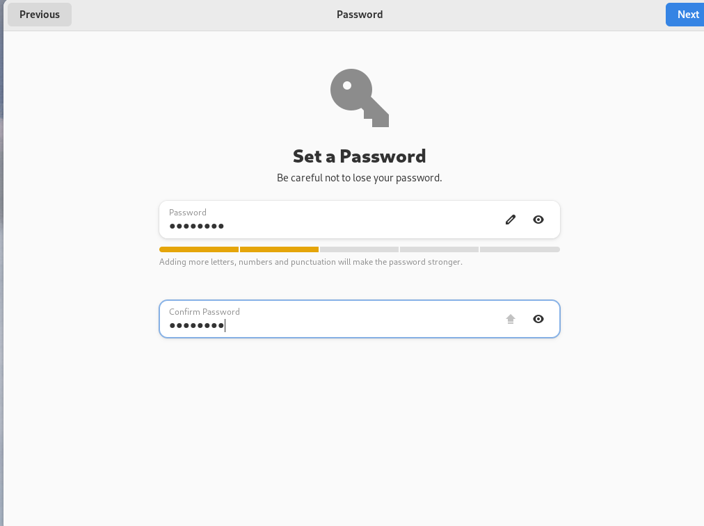{#fig:006 width=70%}

## Установка операционной системы

Нажимаю Win+Enter для запуска терминала и переключаюсь на роль супер-пользователя(рис. @fig:007).

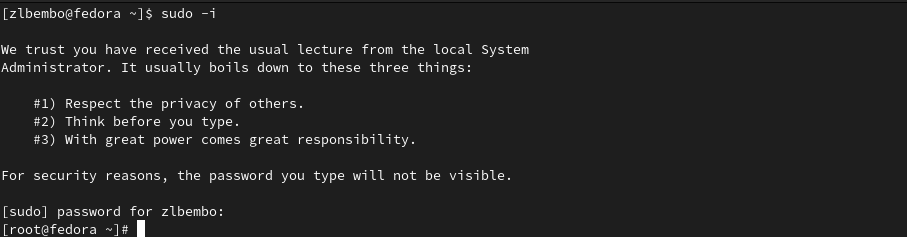{#fig:007 width=70%}

## Установка операционной системы

Обновляю все пакеты (рис. @fig:008).

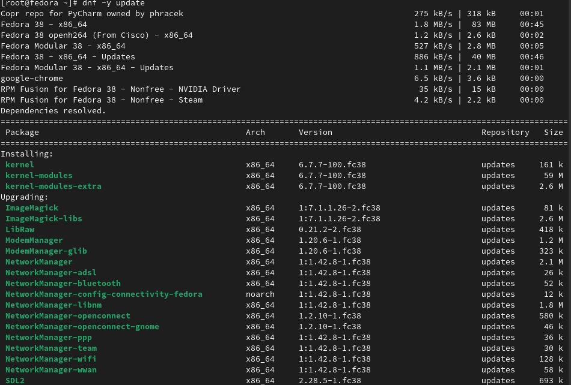{#fig:008 width=70%}

## Установка операционной системы

Устанавливаю программы для удобства работы в концсоли: tmux для открытия нескольких "вкладок" в одном терминале, mc в качестве файлового менеджера в терминале (рис. @fig:09).

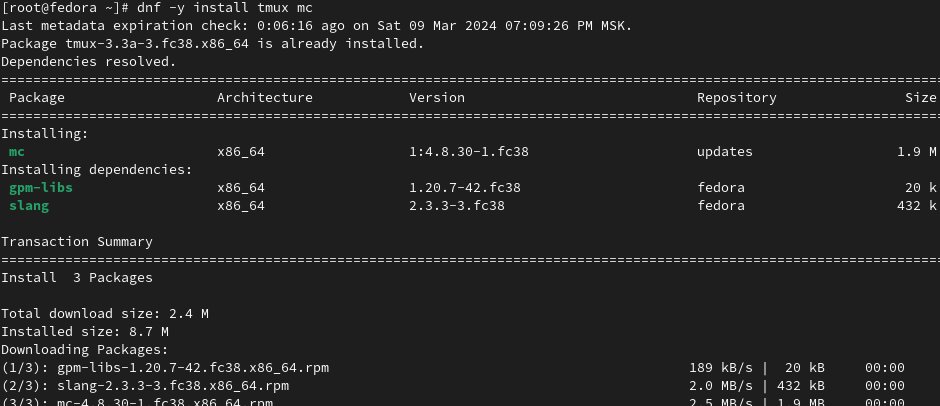{#fig:09 width=70%}

## Установка операционной системы

Устанавливаю программы для автоматического обновления (рис. @fig:010).

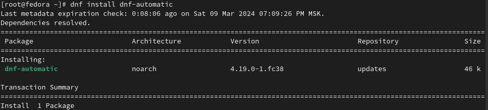{#fig:010 width=70%}

## Установка операционной системы

Запускаю таймер (рис. @fig:011).

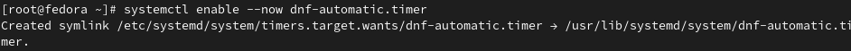{ #fig:011 width=80% }

## Установка операционной системы

Изменяю открытый файл: SELINUX=enforcing меняю на значение SELINUX=permissive (рис. @fig:012).

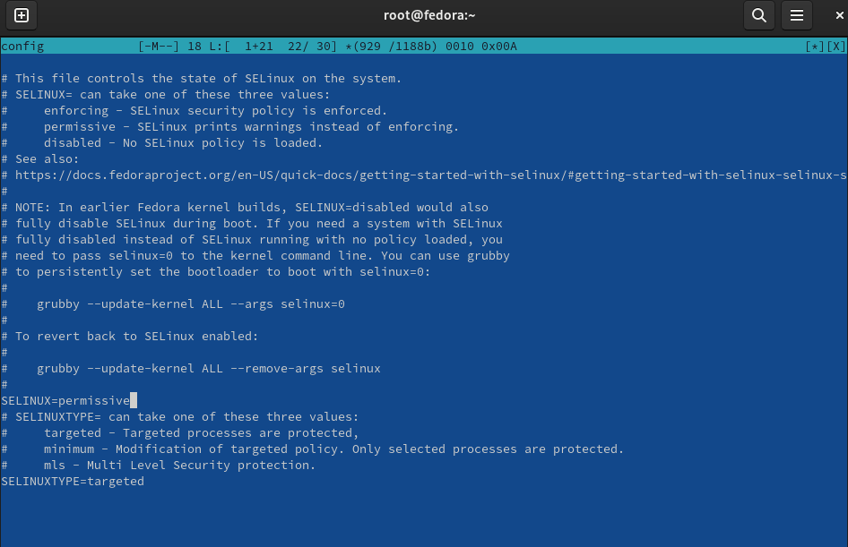{ #fig:012 width=80% }

## Установка операционной системы

Устанавливаю пакет dkms (рис. @fig:013).

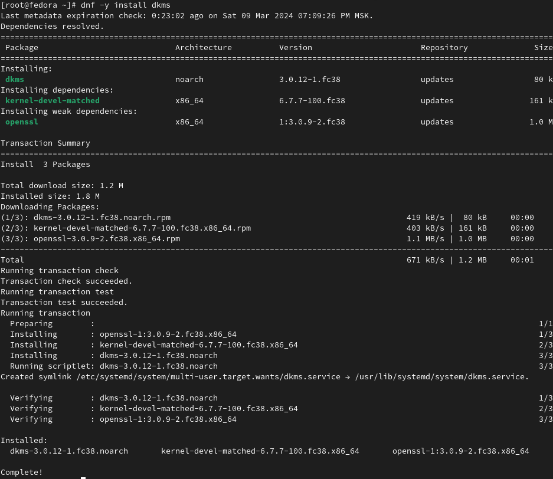{ #fig:013 width=80%}

## Установка операционной системы

Устанавливаю драйвера (рис. @fig:014).

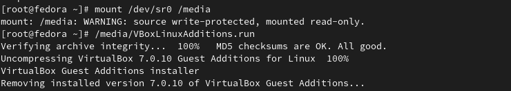{ #fig:014 width=80%}

## Установка операционной системы

Перехожу в директорию /tc/X11/xorg.conf.d, открываю mc для удобства, открываю файл 00-keyboard.conf (рис. @fig:015).

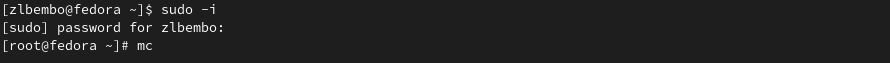{#fig:015 width=70%}

## Установка операционной системы

Редактирую конфигурационный файл (рис. @fig:016).

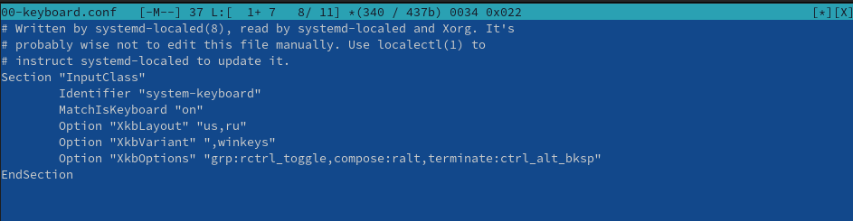{#fig:016 width=70%}

## Установка операционной системы

Установка имени пользователя и названия хоста (рис. @fig:019).

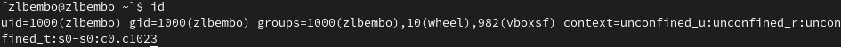{ #fig:019 width=80%}
Все было установлено сразу правильно

## Установка операционной системы

Устанавливаю pandoc с помощью утилиты dnf и флага -y, который автоматически на все вопросы системы отчевает "yes" (рис. @fig:020).

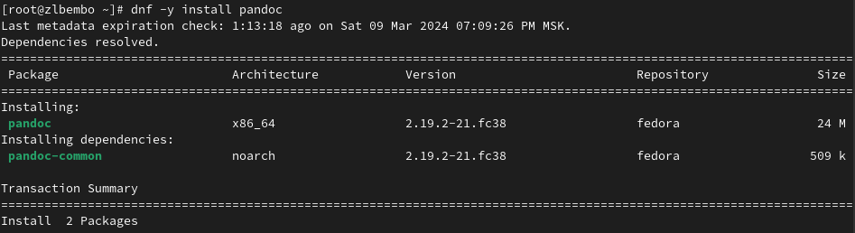{#fig:020 width=70%}

## Установка операционной системы

Устанавливаю дистрибутив texlive (рис. @fig:021).

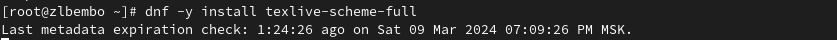{ #fig:021 width=80% }

## Выводы

При выполнении данной лабораторной работы я приобрела практические навыки установки операционной системы на виртуальную машину, а так же сделала настройки минимально необходимых для дальнейшей работы сервисов.

## Домашнее Задание

С помощью поиска, осуществляемого командой 'dmesg | grep -i <что ищем>', ищу версию ядра Linux: 6.1.10-200.fc37.x86_64 (рис. @fig:022).

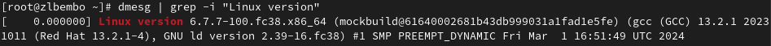{ #fig:022 width=80% }

## Домашнее Задание

К сожалению, если вводить "Detected Mhz processor" там, где нужно указывать, что я ищу, то мне ничего не выведется. Это происходит потому, что запрос не предусматривает дополнительные символы внутри него (я проверяла, будет ли работать он с маской - не будет). В таком случае я оставила одно из ключевых слов (могла оставить два: "Mhz processor") и получила результат: 1992 Mhz (рис. @fig:023).

{ #fig:023 width=80% }

## Домашнее Задание

Аналогично ищу модель процессора (рис. @fig:024).

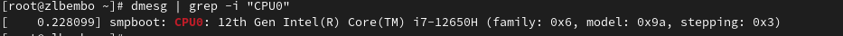{ #fig:024 width=80% }

## Домашнее Задание

Объем доступной оперативной памяти ищу аналогично поиску частоты процессора, т. к. возникла та же проблема, что и там (рис. @fig:025).

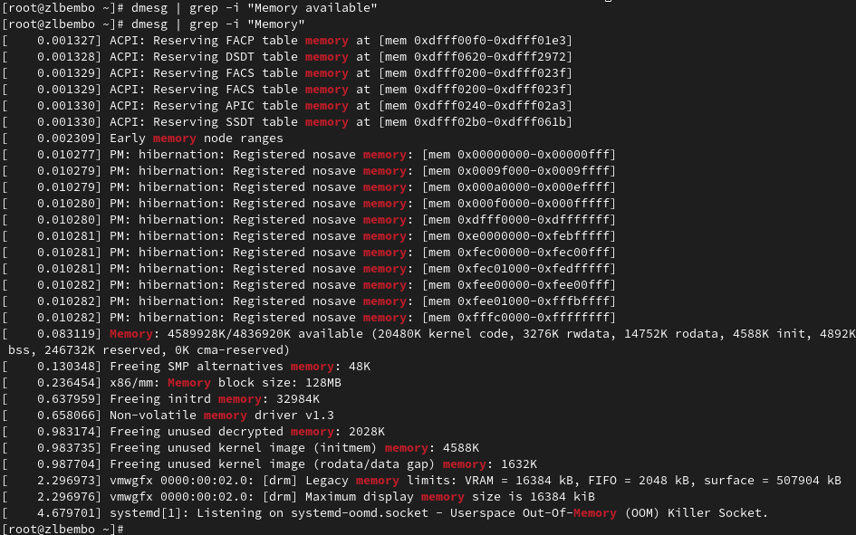{ #fig:025 width=80% }

## Домашнее Задание

Нахожу тип обнаруженного гипервизора (рис. @fig:026).

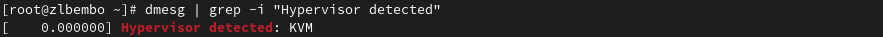{#fig:026 width=70%}

## Домашнее Задание

Тип файловой системы корневого раздела можно посомтреть с помощью утилиты fdisk (рис. @fig:027).

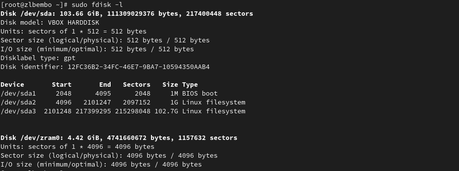{#fig:027 width=70%}

## Домашнее Задание

Последовательность монтирования файловых систем можно посмотреть, введя в поиск по результату dmesg слово mount (рис. @fig:026).

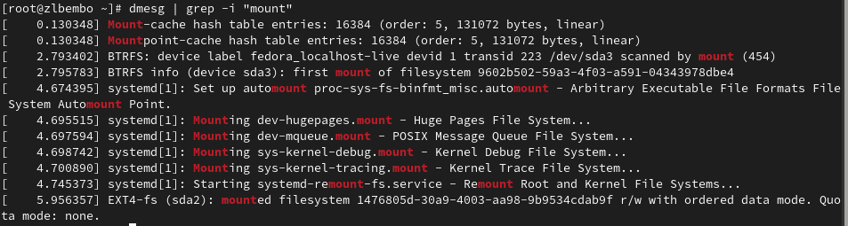{ #fig:028 width=80% }

- На слайд выносится та информация, которая без зрительной опоры воспринимается хуже
- Слайды должны дополнять или обобщать содержание выступления или его частей, а не дублировать его
- Информация на слайдах должна быть изложена кратко, чётко и хорошо структурирована
- Слайд не должен быть перегружен графическими изображениями и текстом
- Не злоупотребляйте анимацией и переходами

## Список литературы{.unnumbered}

::: {#refs}
1. Dash P. Getting started with oracle vm virtualbox. Packt Publishing Ltd, 2013. 86 p.
2. Colvin H. Virtualbox: An ultimate guide book on virtualization with virtualbox. CreateSpace Independent Publishing Platform, 2015. 70 p.
3. van Vugt S. Red hat rhcsa/rhce 7 cert guide : Red hat enterprise linux 7 (ex200 and ex300). Pearson IT Certification, 2016. 1008 p.
4. Робачевский А., Немнюгин С., Стесик О. Операционная система unix. 2-е изд. Санкт-Петербург: БХВ-Петербург, 2010. 656 p.
5. Немет Э. et al. Unix и Linux: руководство системного администратора. 4-е изд. Вильямс, 2014. 1312 p.
6. Колисниченко Д.Н. Самоучитель системного администратора Linux. СПб.: БХВ-Петербург, 2011. 544 p.
7. Robbins A. Bash pocket reference. O’Reilly Media, 2016. 156 p.

:::
