---
## Front matter
title: "Отчет по лабораторной работе №1"
subtitle: "Операционные системы"
author: "БЕМБО ЖОЗЕ ЛУМИНГУ"

## Generic otions
lang: ru-RU
toc-title: "Содержание"

## Bibliography
bibliography: bib/cite.bib
csl: pandoc/csl/gost-r-7-0-5-2008-numeric.csl

## Pdf output format
toc: true # Table of contents
toc-depth: 2
lof: true # List of figures
lot: true # List of tables
fontsize: 12pt
linestretch: 1.5
papersize: a4
documentclass: scrreprt
## I18n polyglossia
polyglossia-lang:
  name: russian
  options:
	- spelling=modern
	- babelshorthands=true
polyglossia-otherlangs:
  name: english
## I18n babel
babel-lang: russian
babel-otherlangs: english
## Fonts
mainfont: PT Serif
romanfont: PT Serif
sansfont: PT Sans
monofont: PT Mono
mainfontoptions: Ligatures=TeX
romanfontoptions: Ligatures=TeX
sansfontoptions: Ligatures=TeX,Scale=MatchLowercase
monofontoptions: Scale=MatchLowercase,Scale=0.9
## Biblatex
biblatex: true
biblio-style: "gost-numeric"
biblatexoptions:
  - parentracker=true
  - backend=biber
  - hyperref=auto
  - language=auto
  - autolang=other*
  - citestyle=gost-numeric
## Pandoc-crossref LaTeX customization
figureTitle: "Рис."
tableTitle: "Таблица"
listingTitle: "Листинг"
lofTitle: "Список иллюстраций"
lotTitle: "Список таблиц"
lolTitle: "Листинги"
## Misc options
indent: true
header-includes:
  - \usepackage{indentfirst}
  - \usepackage{float} # keep figures where there are in the text
  - \floatplacement{figure}{H} # keep figures where there are in the text
---

# Цель работы

Целью данной работы является приобретение практических навыков установки операционной системы на виртуальную машину, настройки минимально необходимых для дальнейшей работы сервисов.

# Задание

1. Создание виртуальной машины
2. Установка операционной системы
3. Работа с операционной системой после установки
4. Установка программного обеспечения для создания документации
5. Дополнительные задания
# Выполнение лабораторной работы

## Создание виртуальной машины

Нажимая "создать", создаю новую виртуальную машину, указываю ее имя, путь к папке машины по умолчанию меня устраивает, выбираю тип ОС и версию (рис. @fig:001).

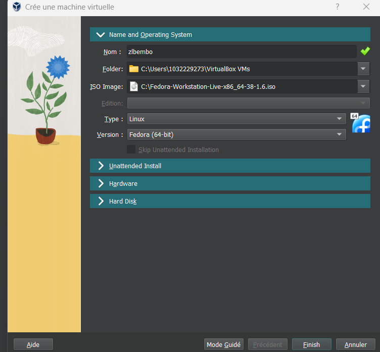{ #fig:001 width=80% }

Задаю размер диска - 103 ГБ, оставляю расположение жесткого диска по умолчанию, т. к. работаю на собственной технике и значение по умолчанию меня устраивает (рис. @fig:002).

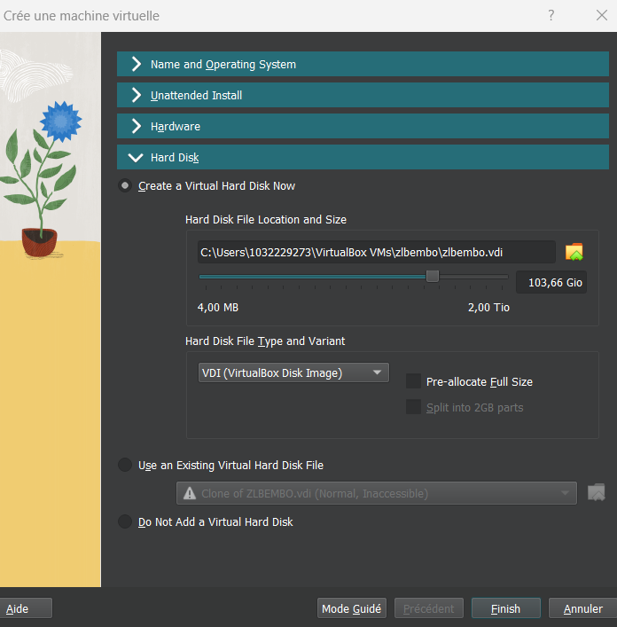{ #fig:002 width=80% }

# Установка операционной системы

Запускаю созданную виртуальную машину для установки (рис. @fig:003).

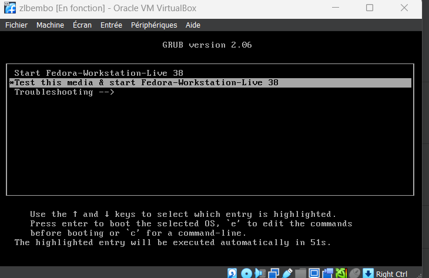{ #fig:003 width=80% }

Далее операционная система устанавливается. После установки нажимаю "завершить установку" (рис. @fig:004).

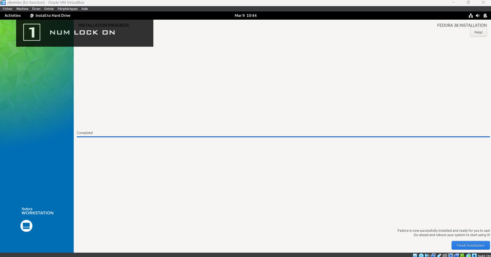{ #fig:004 width=80% }

Создаю пользователя, добавляю административные привилегии для этой учетной записи, чтобы я могла свободно выполнять команды как супер-пользователь (рис. @fig:005).

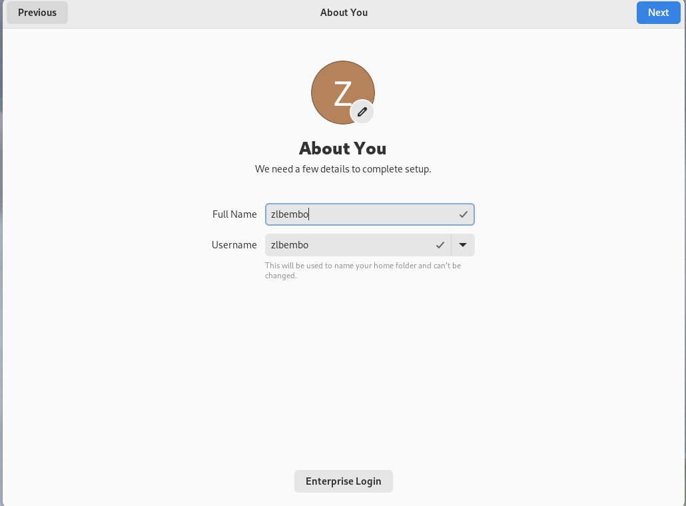{#fig:005 width=70%}

Создаю аккаунт администратора и создаю пароль для супер-пользователя (рис. @fig:006).

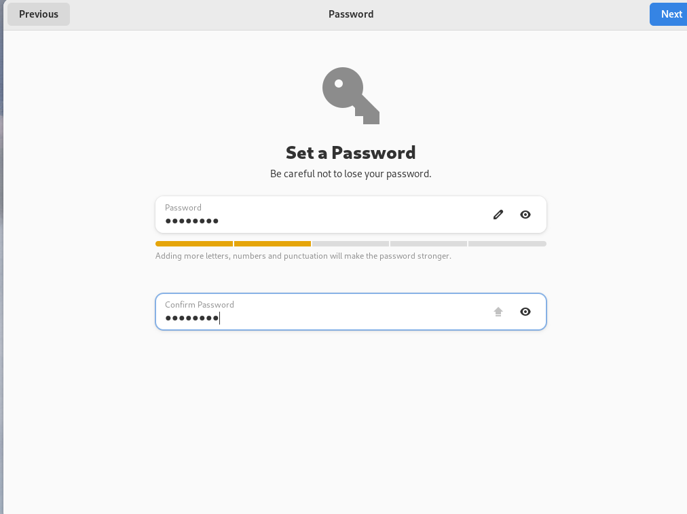{#fig:006 width=70%}

Нажимаю Win+Enter для запуска терминала и переключаюсь на роль супер-пользователя(рис. @fig:007).

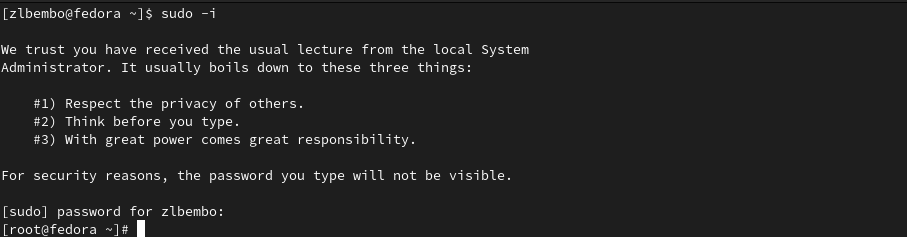{#fig:007 width=70%}

Обновляю все пакеты (рис. @fig:008).

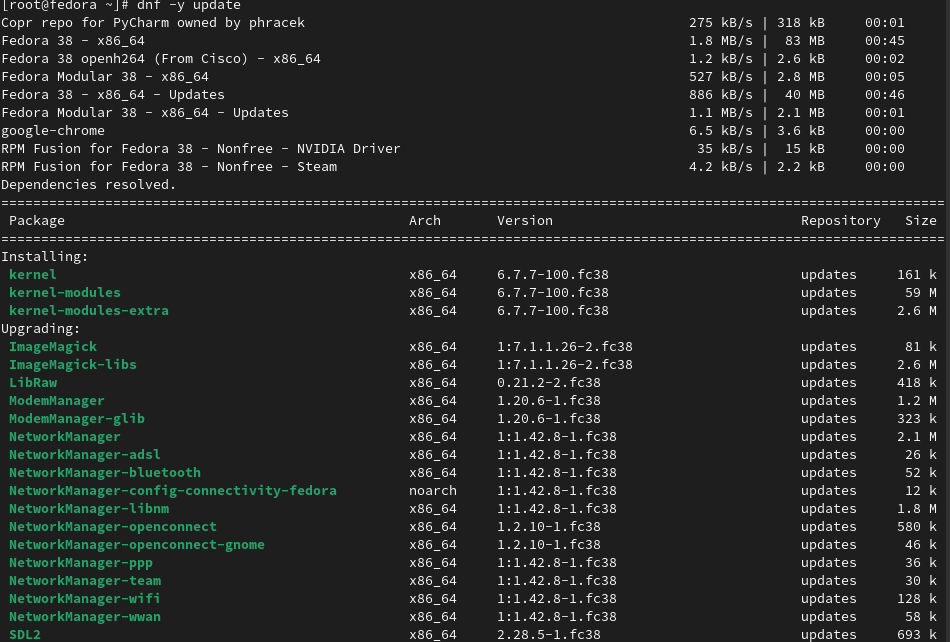{#fig:008 width=70%}

Устанавливаю программы для удобства работы в концсоли: tmux для открытия нескольких "вкладок" в одном терминале, mc в качестве файлового менеджера в терминале (рис. @fig:09).

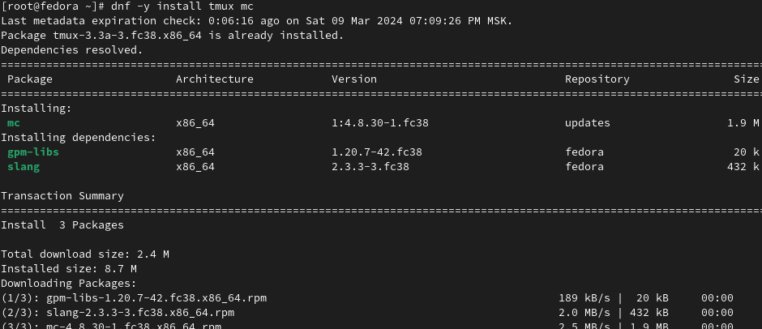{#fig:09 width=70%}

Устанавливаю программы для автоматического обновления (рис. @fig:010).

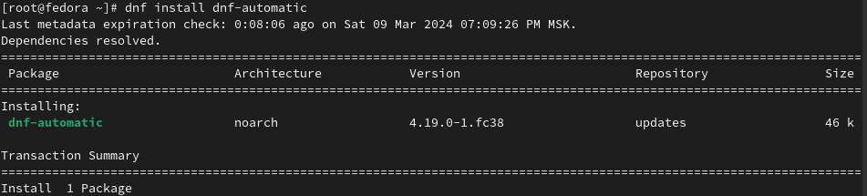{#fig:010 width=70%}

Запускаю таймер (рис. @fig:011).

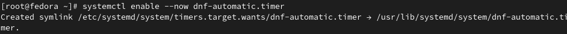{ #fig:011 width=80% }

Изменяю открытый файл: SELINUX=enforcing меняю на значение SELINUX=permissive (рис. @fig:012).

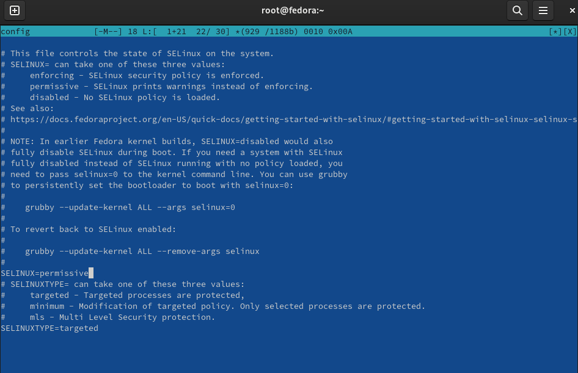{ #fig:012 width=80% }

Устанавливаю пакет dkms (рис. @fig:013).

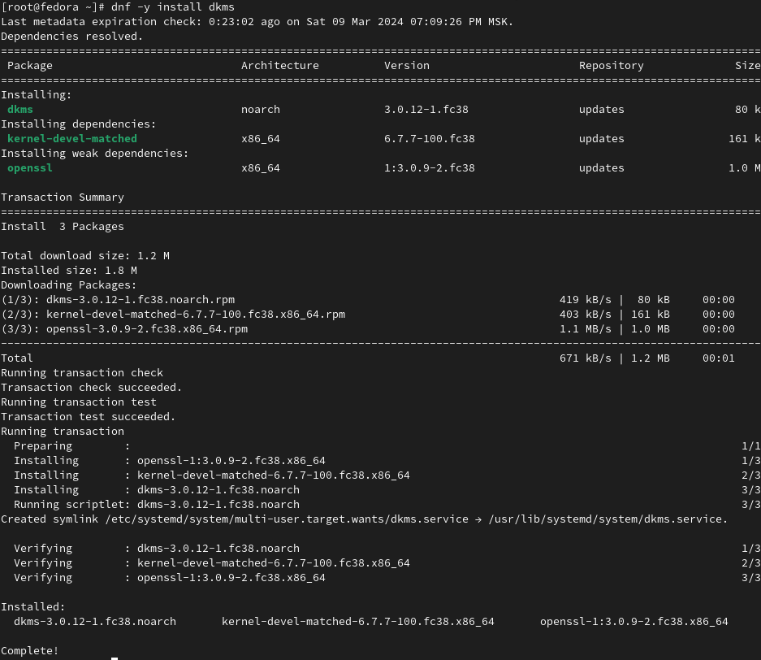{ #fig:013 width=80%}

Устанавливаю драйвера (рис. @fig:014).

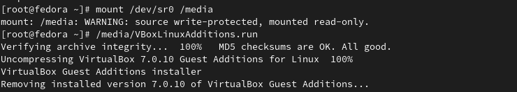{ #fig:014 width=80%}

Перехожу в директорию /tc/X11/xorg.conf.d, открываю mc для удобства, открываю файл 00-keyboard.conf (рис. @fig:015).

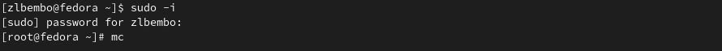{#fig:015 width=70%}

Редактирую конфигурационный файл (рис. @fig:016).

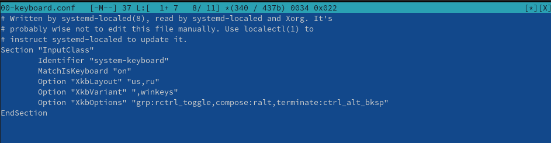{#fig:016 width=70%}

Установка имени пользователя и названия хоста (рис. @fig:017).

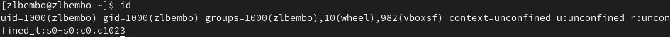{#fig:017 width=80%}
Все было установлено сразу правильно

Устанавливаю pandoc с помощью утилиты dnf и флага -y, который автоматически на все вопросы системы отчевает "yes" (рис. @fig:018).

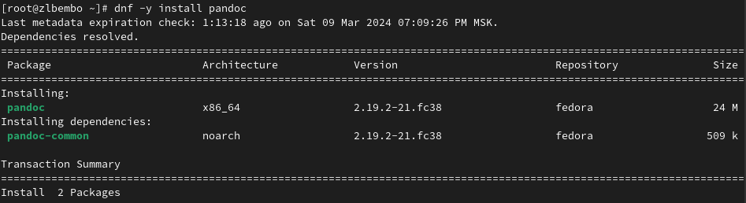{#fig:018 width=70%}

Устанавливаю дистрибутив texlive (рис. @fig:019).

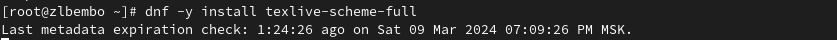{ #fig:019 width=80% }

# Выводы

При выполнении данной лабораторной работы я приобрела практические навыки установки операционной системы на виртуальную машину, а так же сделала настройки минимально необходимых для дальнейшей работы сервисов.

# Домашнее Задание

С помощью поиска, осуществляемого командой 'dmesg | grep -i <что ищем>', ищу версию ядра Linux: 6.1.10-200.fc37.x86_64 (рис. @fig:020).

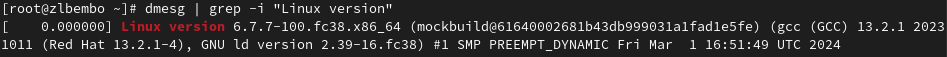{ #fig:020 width=80% }

К сожалению, если вводить "Detected Mhz processor" там, где нужно указывать, что я ищу, то мне ничего не выведется. Это происходит потому, что запрос не предусматривает дополнительные символы внутри него (я проверяла, будет ли работать он с маской - не будет). В таком случае я оставила одно из ключевых слов (могла оставить два: "Mhz processor") и получила результат: 1992 Mhz (рис. @fig:021).

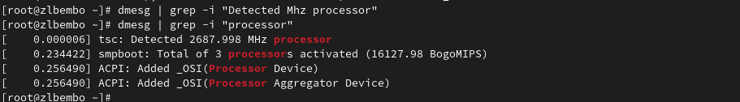{ #fig:021 width=80% }

Аналогично ищу модель процессора (рис. @fig:022).

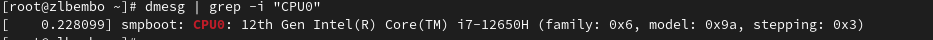{ #fig:022 width=80% }

Объем доступной оперативной памяти ищу аналогично поиску частоты процессора, т. к. возникла та же проблема, что и там (рис. @fig:023).

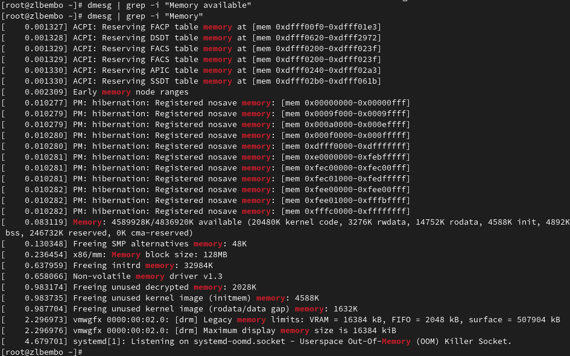{ #fig:023 width=80% }

Нахожу тип обнаруженного гипервизора (рис. @fig:024).

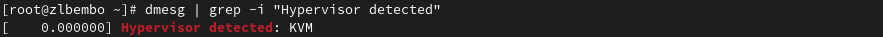{#fig:024 width=70%}

Тип файловой системы корневого раздела можно посомтреть с помощью утилиты fdisk (рис. @fig:025).

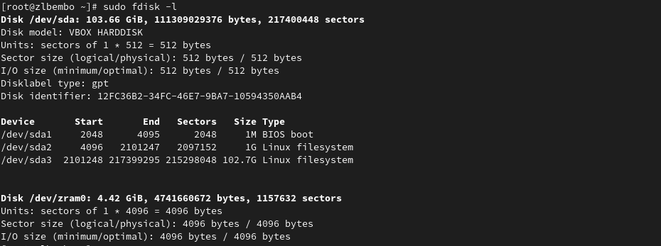{#fig:025 width=70%}

Последовательность монтирования файловых систем можно посмотреть, введя в поиск по результату dmesg слово mount (рис. @fig:026).

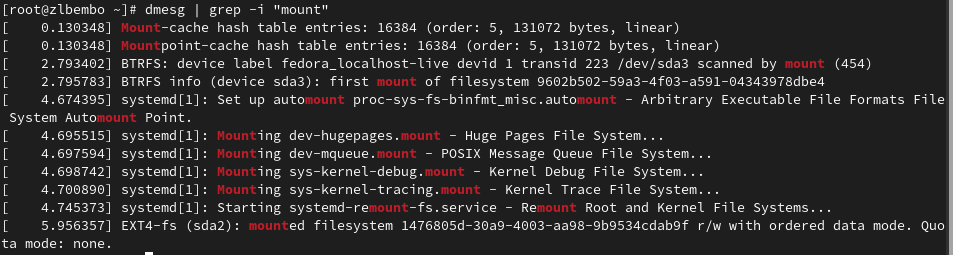{ #fig:026 width=80% }

# Контрольные Вопросы

1. Какую информацию содержит учётная запись пользователя? 

Имя пользователя, зашифрованный пароль пользователя, идентификационный номер пользователя, идентификационный номер группы пользователя, домашний каталог пользователя, командный интерпретатор пользователя. 

2. Укажите команды терминала и приведите примеры: – для получения справки по команде; – для перемещения по файловой системе; – для просмотра содержимого каталога; – для определения объёма каталога; – для создания / удаления каталогов / файлов; – для задания определённых прав на файл / каталог; – для просмотра истории команд. 

a) для получения справки по команде: man <название команды> 
b) для перемещения по файловой системе: cd 
c) для просмотра содержимого каталога: ls 
d) для определения объёма каталога: du <имя каталога> 
e) для создания каталогов: mkdir <имя каталога> 
f) для создания файлов: touch <имя файла> 
g) для удаления каталогов: rm <имя каталога> 
h) для удаления файлов: rm –r <имя фйала> 
i) для задания определённых прав на файл / каталог: chmod + x <имя файла/каталога> 
j) для просмотра истории команд: history 

3. Что такое файловая система? Приведите примеры с краткой характеристикой. 

Файловая система — это часть операционной системы, назначение которой состоит в 
том, чтобы обеспечить пользователю удобный интерфейс при работе с данными, 
хранящимися на диске, и обеспечить совместное использование файлов несколькими 
пользователями и процессами. 
Примеры файловых систем: 

• Ext2, Ext3, Ext4 или Extended Filesystem – стандартная файловая система для Linux. 
• JFS или Journaled File System была разработана в IBM для AIX UNIX и 
использовалась в качестве альтернативы для файловых систем ext. Она используется 
там, где необходима высокая стабильность и минимальное потребление ресурсов. 
• ReiserFS – была разработана намного позже, но в качестве альтернативы ext3 с 
улучшенной производительностью и расширенными возможностями. 
• XFS – это высокопроизводительная файловая система. Преимущества: высокая 
скорость работы с большими файлами, отложенное выделение места, увеличение 
разделов на лету и незначительный размер служебной информации. [3] 

4. Как посмотреть, какие файловые системы подмонтированы в ОС? 

С помощью команды mount. 

5. Как удалить зависший процесс? 

С помощью команды kill.

# Выводы

Приобрел практические навыкм установки операционной системы на виртуальную машину, настройки минимально необходимых для дальнейшей работы сервисов.

# Список литературы{.unnumbered}

::: {#refs}
1. Dash P. Getting started with oracle vm virtualbox. Packt Publishing Ltd, 2013. 86 p.
2. Colvin H. Virtualbox: An ultimate guide book on virtualization with virtualbox. CreateSpace Independent Publishing Platform, 2015. 70 p.
3. van Vugt S. Red hat rhcsa/rhce 7 cert guide : Red hat enterprise linux 7 (ex200 and ex300). Pearson IT Certification, 2016. 1008 p.
4. Робачевский А., Немнюгин С., Стесик О. Операционная система unix. 2-е изд. Санкт-Петербург: БХВ-Петербург, 2010. 656 p.
5. Немет Э. et al. Unix и Linux: руководство системного администратора. 4-е изд. Вильямс, 2014. 1312 p.
6. Колисниченко Д.Н. Самоучитель системного администратора Linux. СПб.: БХВ-Петербург, 2011. 544 p.
7. Robbins A. Bash pocket reference. O’Reilly Media, 2016. 156 p.

:::
