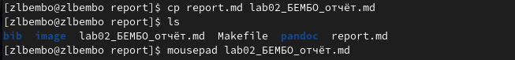
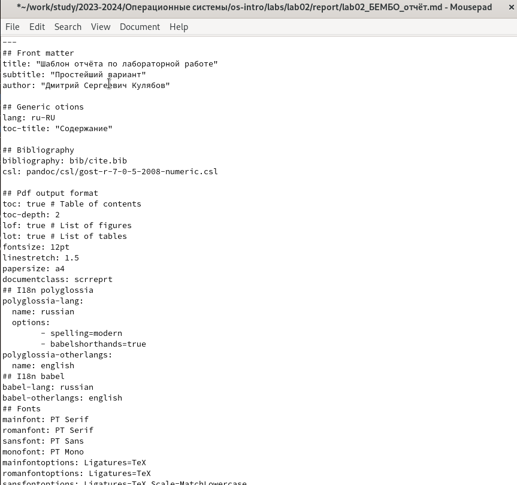
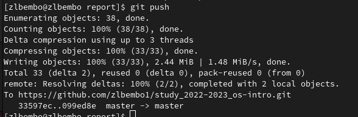
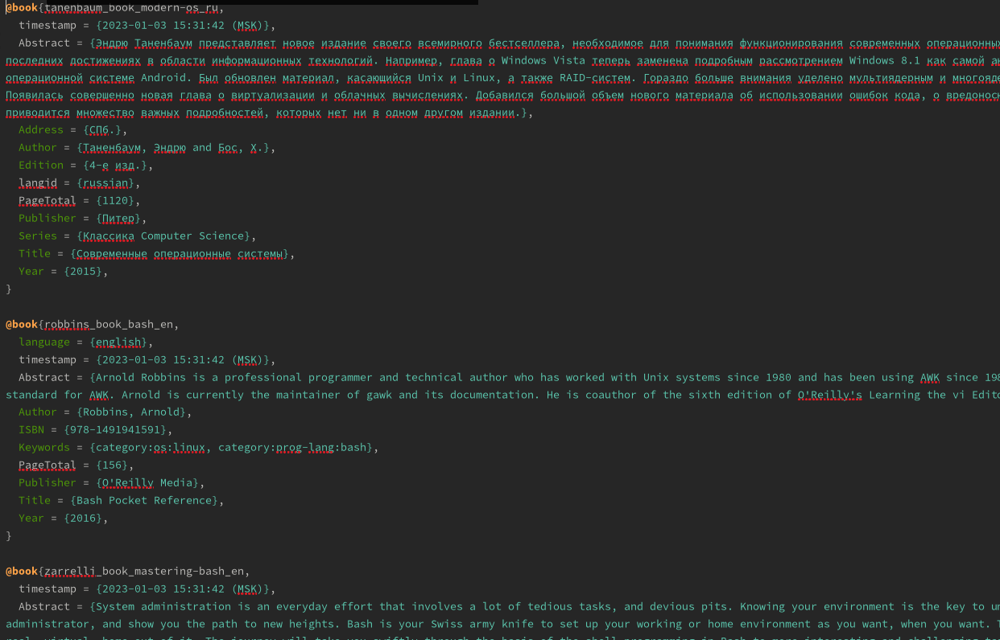

---
## Front matter
lang: ru-RU
title: Структура научной презентации
subtitle: Простейший шаблон
author:
  - Кулябов Д. С.
institute:
  - Российский университет дружбы народов, Москва, Россия
  - Объединённый институт ядерных исследований, Дубна, Россия
date: 01 января 1970

## i18n babel
babel-lang: russian
babel-otherlangs: english

## Formatting pdf
toc: false
toc-title: Содержание
slide_level: 2
aspectratio: 169
section-titles: true
theme: metropolis
header-includes:
 - \metroset{progressbar=frametitle,sectionpage=progressbar,numbering=fraction}
 - '\makeatletter'
 - '\beamer@ignorenonframefalse'
 - '\makeatother'
---

## Цели и задачи

- Научиться оформлять отчёты с помощью легковесного языка разметки Markdown.
- Сделаnm отчёт по предыдущей лабораторной работе в формате Markdown.

## Теоретическое введение

Markdown — облегчённый язык разметки, созданный с целью обозначения форматирования в простом тексте, с максимальным сохранением его читаемости человеком, и пригодный для машинного преобразования в языки для продвинутых публикаций.

## Выполнение лабораторной работы

Создаю копию шаблона, в которой буду работать (рис. 1).

{width=50%}

## Выполнение лабораторной работы

- открываю созданный файл (рис. 2).
- редактирую его, используя язык рамзетки Markdown

{width=70%}

## Выполнение лабораторной работы

- работа с библиографией (рис. 3).
- вставка ссылок в текст отчета

{width=70%}

## Выполнение лабораторной работы

Выполнила компиляцию отчета из формата md в форматы docx и pdf (рис. 4).

{width=70%}

## Выводы

При выполнении данной лабораторной работы я научилась оформлять отчеты с помощью легковесного языка разметки Markdown.

# Спасибо за внимание
