---
## Front matter
lang: ru-RU
title: Лабораторная работа №4
subtitle: Операционные системы
author:
  - БЕМБО Ж. Л.
institute:
  - Российский университет дружбы народов, Москва, Россия
date: 15 апрель 2024

## i18n babel
babel-lang: russian
babel-otherlangs: english

## Formatting pdf
toc: false
toc-title: Содержание
slide_level: 2
aspectratio: 169
section-titles: true
theme: metropolis
header-includes:
 - \metroset{progressbar=frametitle,sectionpage=progressbar,numbering=fraction}
 - '\makeatletter'
 - '\beamer@ignorenonframefalse'
 - '\makeatother'
---

# Информация

## Докладчик

:::::::::::::: {.columns align=center}
::: {.column width="70%"}

  * Кулябов Дмитрий Сергеевич
  * д.ф.-м.н., профессор
  * профессор кафедры прикладной информатики и теории вероятностей
  * Российский университет дружбы народов
  * [kulyabov-ds@rudn.ru](mailto:kulyabov-ds@rudn.ru)
  * <https://yamadharma.github.io/ru/>

:::
::: {.column width="30%"}

:::
::::::::::::::

## Цель лабораторной работы

Цель данной лабораторной работы -- приобретение практических навыков взаимодействия пользователя с системой посредством командной строки.

## Теоретическое введение

В операционной системе типа Linux взаимодействие пользователя с системой обычно
осуществляется с помощью командной строки посредством построчного ввода команд.

Командой в операционной системе называется записанный по специальным правилам текст, представляющий собой указание на выполнение какой-либо функций в операционной системе.
Обычно первым словом идёт имя команды, остальной текст — аргументы или опции,
конкретизирующие действие.

Общий формат команд можно представить следующим образом:
<имя_команды><разделитель><аргументы>

# Выполнение лабораторной работы

## Узнать полное имя домашнего каталога.

Утилоита pwd.

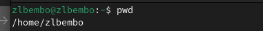

## Перемещение между директориями

С помощью утилиты cd перехожу в подкаталог tmp корневого каталога.

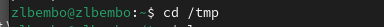

## Просмотр содержимого каталога

С помощью утилиты ls, пока что без ключей, просматриваю содержимое каталога tmp.
Опция -l позволит увидеть дополнительную информацию о файлах в каталоге: время создания, владельца, права доступа.
Опция -a покажет скрытые файлы в каталоге.

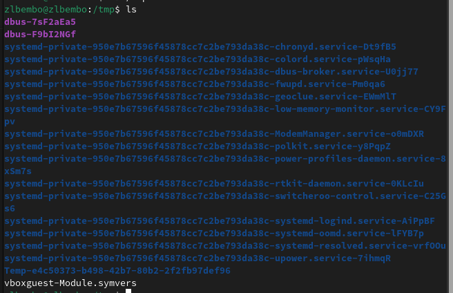

## Поиск файла в директории

Чтобы определить, есть ли в каталоге подкатлог с соответствющим именем воспользуемся утилитой ls с флагом -F, чтобы проверить, что мы найдем именно каталог.

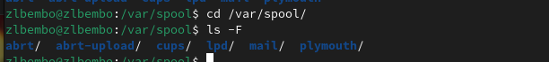

## Изучение файлов директории

Затем проверяю содержимое каталога с помощью утилиты ls.

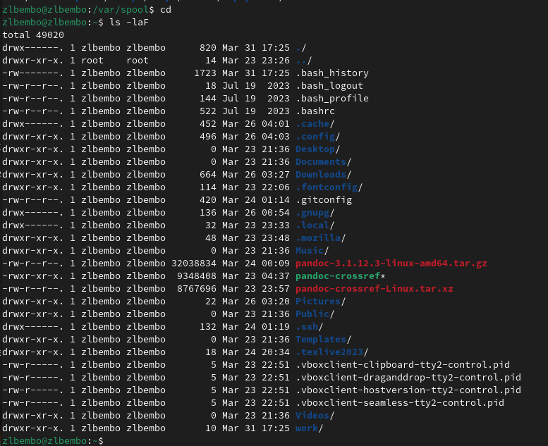
## Создание директорий

Создаю директорию newdir с помощью утилиты mkdir.

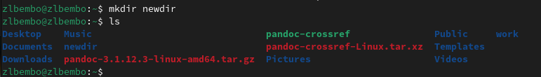

Создаю для каталога newdir подкаталог morefun, проверяю, что каталог создан.

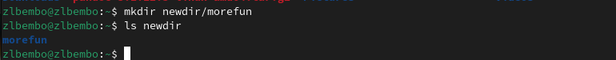

## Создание и удаление директорий

Создание нескольких директорий одной строчкой.

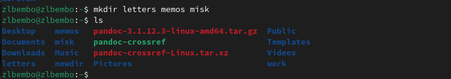

Удаляю несколько **пустых** директорий одной строчкой.

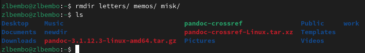

## Удаление директорий

Пытаюсь удалить newdir с помощью rm.

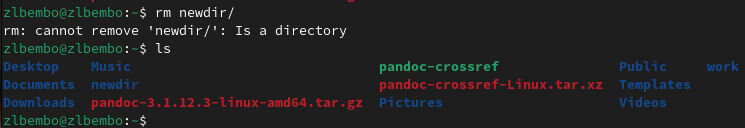

Удаляю директорию newdir с помощью утилиты rmdir, т.к директория не пустая, я добавляю флаг удалить рекурсивно -p.

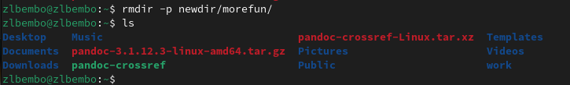

## Опции ls

С помощью команды man ls я могу прочесть документацию к команде ls.

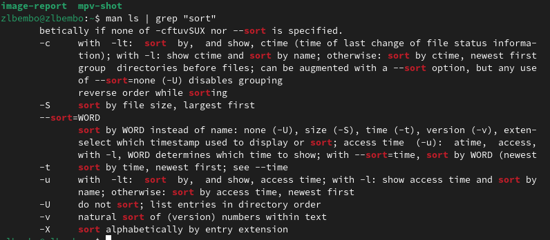

## cd

С помощью man cd узнаю описание команды cd и ее опции. Основных опций немного
1. -P - позволяет следовать по символическим ссылкам перед тем, как обработаны все переходы '..'
3. -L - переходит по символическим ссылкам только после того, как обработаны все переходы ".."
4. -e - позволяет выйти с ошибкой, если диреткория, в которую нужно перейти, не найдена.

## pwd

С помощью man pwd узнаю описание команды pwd и ее опции
1. -L - брать директорию из переменной окружения, даже если она содержит символические ссылки.
2. -P - отбрасывать все символические ссылки.

## mkdir

С помощью man mkdir узнаю описание команды mkdir и ее опции
1. -m - устанавливает права доступа создаваемой директории как chmod, синтаксис тоже как у chmod.
2. -p - позволяет рекурсивно создавать директории и их подкаталоги
3. -v - выводи сообщение о созданных директориях
4. -z - установить контекст SELinux для создаваемой директории по умолчанию
5. -context - установить контекст SELinux для создаваемой директории в значении CTX

## rmdir

С помощью man rmdir узнаю описание команды rmdir и ее опции
1. --ignore-fail-on-non-empty - отменяет вывод ошибки, если каталог не пустой, просто его игнорирует
2. -p - удаляет рекурсивно каталоги, если они все содержат в себе только удаляемый каталог
3. -v - выводит сообщение о каждом удалении  директории.

## rm

С помощью man rm узнаю описание команды rm и ее опции
1. -f - игнорировать несуществующие файлы или аргументы, никогда не выводить запрос на подтверждение удаления
2. -i - выводить запрос на подтверждение удаления каждого файла
3. -I - вывести запрос на подтверждение удаления один раз, для всех файлов, если удаляется больше 3-х файлов или идет рекурсивное удаление
4. -r, -R - удаляет директории их содержимое рекурсивно
5. -d, --dir - удаляет пустые директории
6. -v - прописывает все действия команды

## Примечание

Опции --help --version применимы почти ко всем утилитам, они показывают справку по команде и ее версию соответственно.

## history

Вывела историю команд с помощью утилиты history.

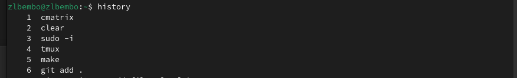

## Модификация команд

!номеркоманды в выводе history:s/что заменяем/на что заменяем.

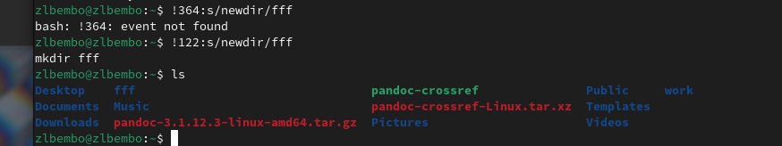

