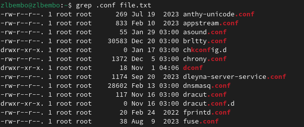
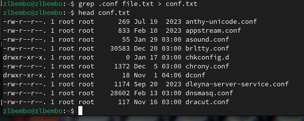
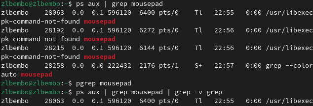

## Докладчик

:::::::::::::: {.columns align=center}
::: {.column width="70%"}

  * БЕМБО ЛУМИНГУ ЖОЗЕ
  * студентка из группы НКАбд-01-23
  * Факультет физико-математических и естественных наук
  * Российский университет дружбы народов
  * 1032229273@rudn.ru](mailto:1032229273@rudn.ru)
  * <https://github.com/zlbembo1>

:::
::: {.column width="30%"}

:::
::::::::::::::

## Цель работы

Цель данной лабораторной работы - ознакомление с инструментами поиска файлов и фильтрации текстовых данных, а также приобретение практических навыков по управлению процессами (и заданиями), по проверке использования диска и по обслуживанию файловых систем.

# Выполнение лабораторной работы

## Выполнение лабораторной работы

Записал в файл file.txt названия файлов из каталога /etc с помощью перенаправления ">".

## Выполнение лабораторной работы

Добавил в созданный файл имена файлов из домашнего каталога, используя перенаправление ">>" в режиме добавления.

## Выполнение лабораторной работы

Вывела на экран имена всех файлов, имеющих расширение ".conf" с помощью утилиты grep

## Выполнение лабораторной работы

Добавил вывод прошлой команды в новый файл conf.txt с помощью перенаправления ">".

## Выполнение лабораторной работы

Определяю, какие файлы в домашнем каталоге начинаютя с символа "c" с помощью утилиты find, прописываю ей в аргументах домашнюю директорию, выбираю опцию -name.

## Выполнение лабораторной работы

Второй способ использовать утилиту ls -lR и использовать grep, чтобы найти элементы с первым символом c.

## Выполнение лабораторной работы

Запускаю в фоновом режиме (на это указывает символ &) процесс, который будет записывать в файл logfile файлы, имена которых начинаются с log.

## Выполнение лабораторной работы

Запускаю в консоли в фоновом режиме редактор mousepad.

## Выполнение лабораторной работы

С помощью утилиты ps определяю идентификатор процесса mousepad, его значение 3913. Также мы можем определить идентификатор с помощью pgrep.

## Выполнение лабораторной работы

Использую команду kill и идентификатор процесса, чтобы его удалить.

## Выполнение лабораторной работы

Использую утилиту df. Эта утилита нам нужна, чтобы выяснить, сколько свободного места есть у системы.

## Выполнение лабораторной работы

Использую утилиту du. Она нужна чтобы просмотреть, сколько места занимают файлы в определенной директории.

## Выполнение лабораторной работы

Вывела имена всех директорий, имеющихся в моем домашнем каталоге.

## Выводы

В результате данной лабораторной работы я ознакомилась с инструментами поиска файлов и фильтрации текстовых данных, а также приобрела практические навыки по управлению процессами (и заданиями), по проверке использования диска и по обслуживанию файловых систем.

