---
## Front matter
lang: ru-RU
title: Лабораторная работа №7
subtitle: Операционные системы
author:
  -  Бембо лумингу жозе
institute:
  - Российский университет дружбы народов, Москва, Россия

date: 21 июнь 2024

## i18n babel
babel-lang: russian
babel-otherlangs: english

## Formatting pdf
toc: false
toc-title: Содержание
slide_level: 2
aspectratio: 169
section-titles: true
theme: metropolis
header-includes:
 - \metroset{progressbar=frametitle,sectionpage=progressbar,numbering=fraction}
 - '\makeatletter'
 - '\beamer@ignorenonframefalse'
 - '\makeatother'
---

## Докладчик

:::::::::::::: {.columns align=center}
::: {.column width="70%"}

  * Бембо лумингу жозе
  * студент из группы НКАбд-01-23
  * Факультет физико-математических и естественных наук
  * Российский университет дружбы народов
  * [1032229273@rudn.ru](mailto:1032229273@rudn.ru)
  * <https://github.com/zlbembo1>

:::
::: {.column width="30%"}

:::
::::::::::::::

## Цель работы

Цель данной лабораторной работы - освоение основных возможностей командной оболочки Midnight Commander, приобретение навыков практической работы по просмотру каталогов и файлов; манипуляций с ними

## Выполнение лабораторной работы

С помощью команды man mc прочитал документацию про командную оболочку.

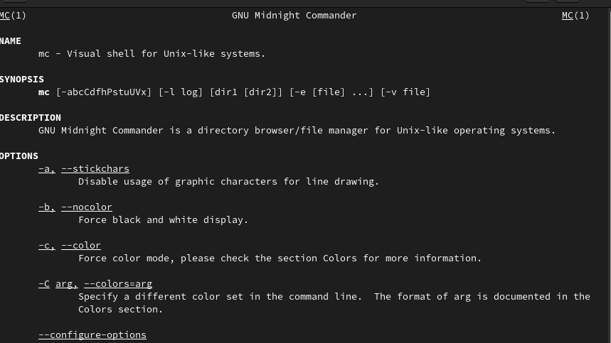

## Выполнение лабораторной работы

Ввожу в терминале mc и получаю окно, в котором далее смогу работать.

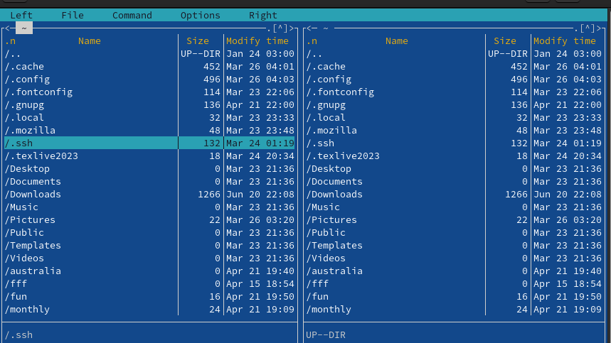

## Выполнение лабораторной работы

С помощью стрелочек влево вправо я могу перемещаться по директориям, а с помощью стрелочек вверх вниз перебирать файлы в директории, в которой нахожусь.

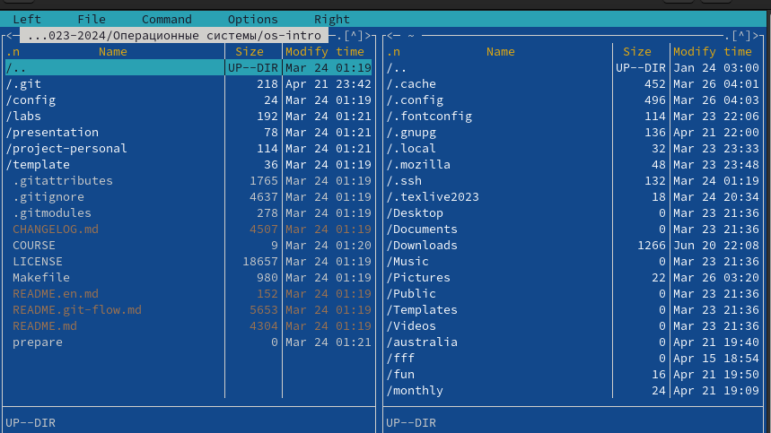

## Выполнение лабораторной работы

С помощью F5 могу создать копию файла в выбранном каталоге/

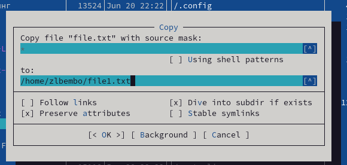

## Выполнение лабораторной работы

 С помощью управляющих клавиш так же можно получить информациб о правах доступа на файл и информацию о нем.

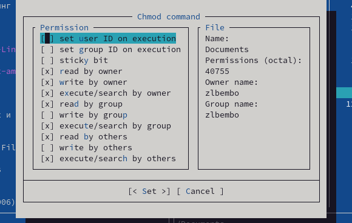.

## Выполнение лабораторной работы

В меню правой панели вывел информацию о файле.

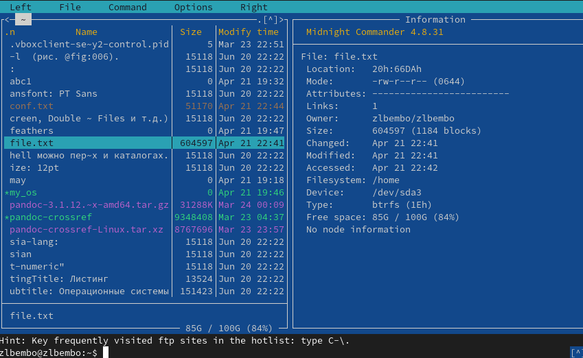

## Выполнение лабораторной работы

Используя возможности подменю "Файл" я просмотрел содержимое текстового файла.

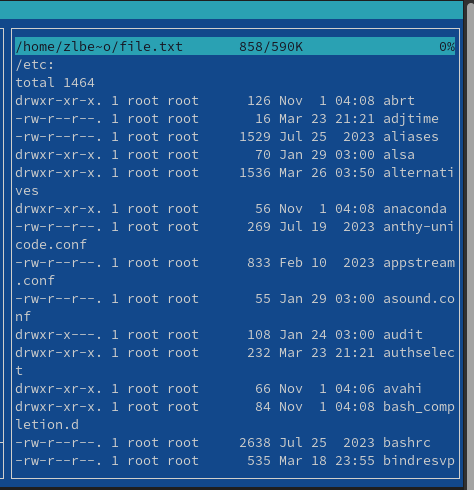

## Выполнение лабораторной работы

Открыла файл на изменение, поменял пару строк и закрыла файл без сохранения.

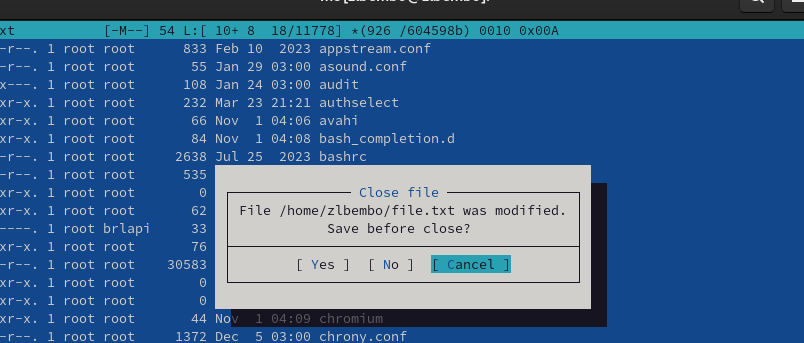

## Выполнение лабораторной работы

Создал новый каталог.

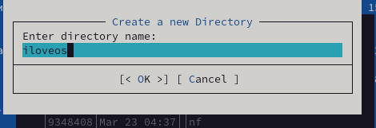

## Выполнение лабораторной работы

Копирую файл в созданный каталог.
Действия выше можно было сделать с помощью горячих клавиш.

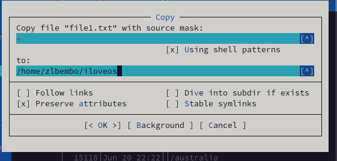

## Выполнение лабораторной работы

С помощью средств подменю Команда можно найти файл с заданным условием, я искала файлы формата .txt.

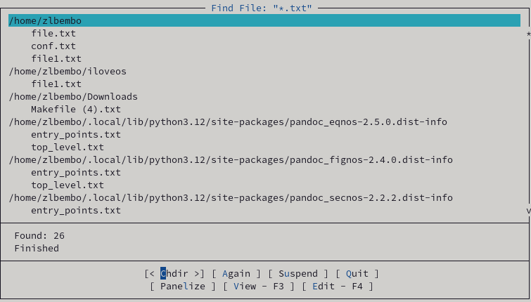

## Выполнение лабораторной работы

Можно перемещаться между директориями, я перемещусь в домашнюю.

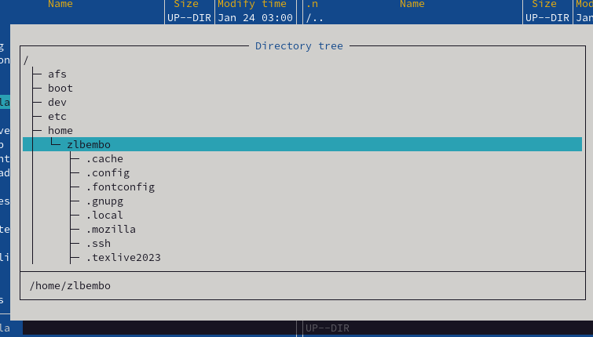

## Выполнение лабораторной работы

Можно использовать историю команд и применить команду из истории, я применила копирование файла.

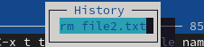

## Выполнение лабораторной работы

Анализирую файл расширения и меню.

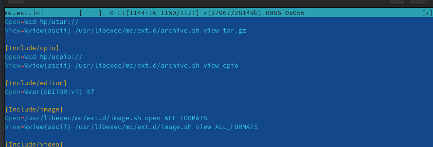

## Выполнение лабораторной работы

Из подменю настройки вызвала окна настройки панели, настройки внешнего вида, настройки распознавания клавиш, параметры конфигурации.

## Выполнение лабораторной работы

Командой touch text.txt создала файл.

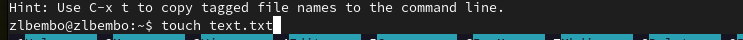

## Выполнение лабораторной работы

Клавишей F4 открыла файл для записи, добавила в него текст.

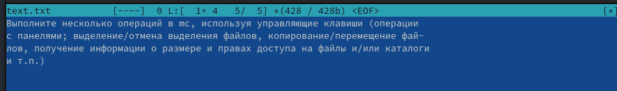

## Выполнение лабораторной работы

Выделяю текст с помощью клавиши F3 и кликов мышью.

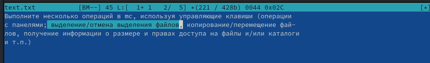

## Выполнение лабораторной работы

Перемещаю выделенный текст с помощью клавиши F6.

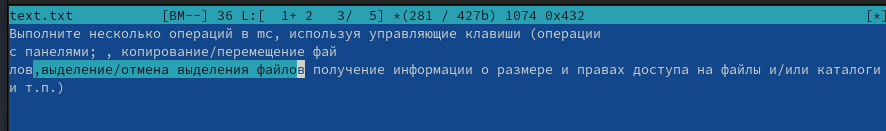

## Выполнение лабораторной работы

Удалил строку текста с помощью ctrl+y.

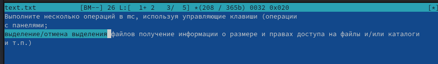

## Выполнение лабораторной работы

Сохраняю изменения в файле с помощью горячей клавиши F2.

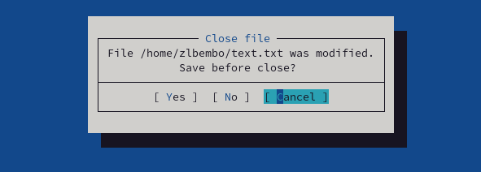

## Выполнение лабораторной работы

С помощью ctrl+u отменяю поседнее действие и возвращаю удаленную строку.

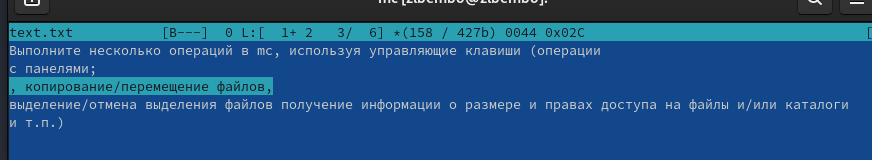

## Выполнение лабораторной работы

С помощью клавиш pgup pgdn у меня получилось попасть в начало и в конец файла соответственно, я добавила текст в начало и в конец файла.

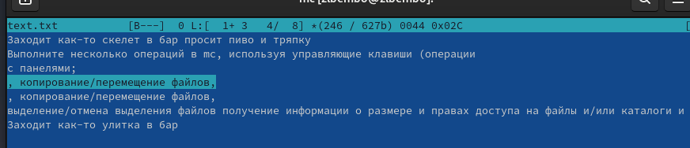

## Выполнение лабораторной работы

Горячая клавиша F10 закрывает файл, дополнительно спрашивая сохранить ли в нем несохраненные изменения, сохраняю и закрываю.

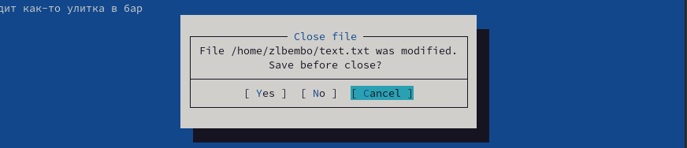

## Выполнение лабораторной работы

Открываю файл формата .cpp, с кодом на С++, встроенный редактор mc вывел его содержимое с подсветкой.

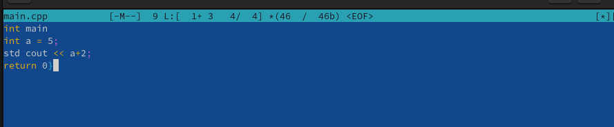

## Выполнение лабораторной работы

Я отключил подсветку и вывела снова тот же самый файл, но уже без подсветки.

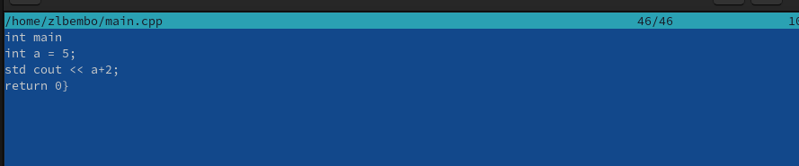

# Выводы

При выполнениии данной лабораторной работы я освоила основные возможности командной оболочки Midnight Commander, приобрела навыки практической работы по просмотру каталогов и файлов; манипуляций с ними
