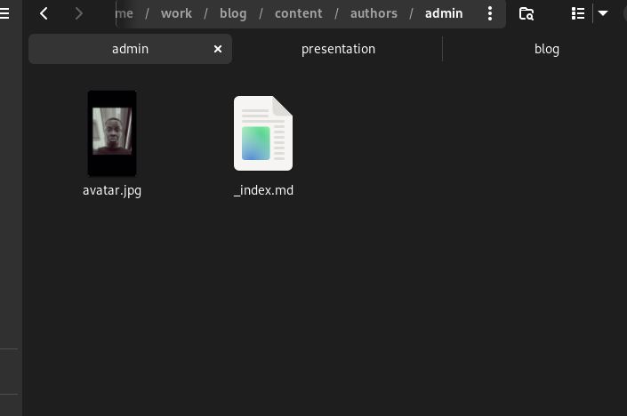
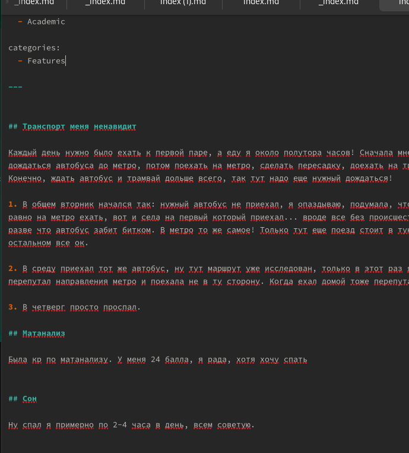
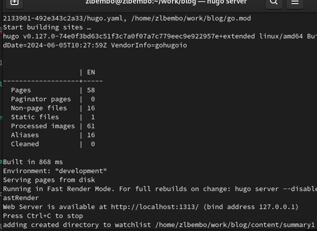
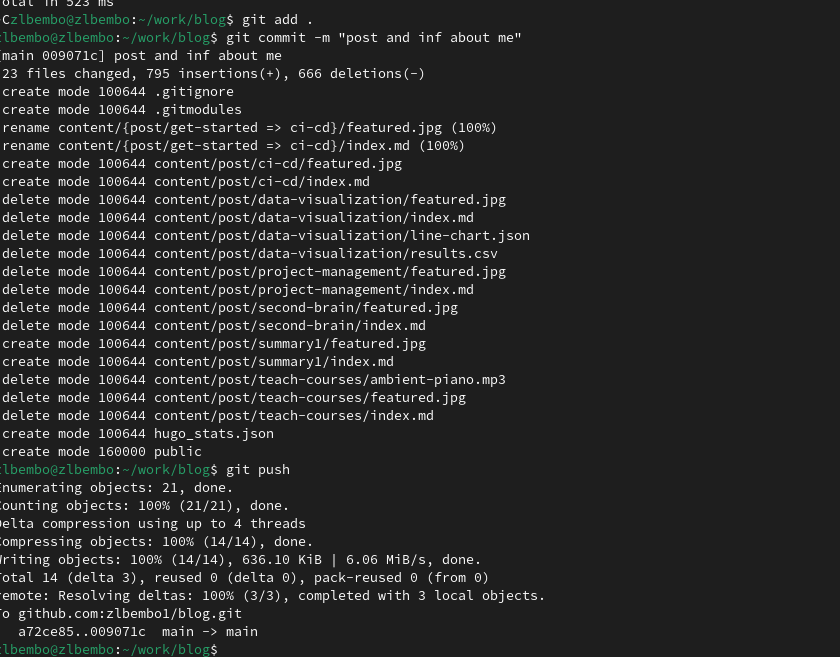
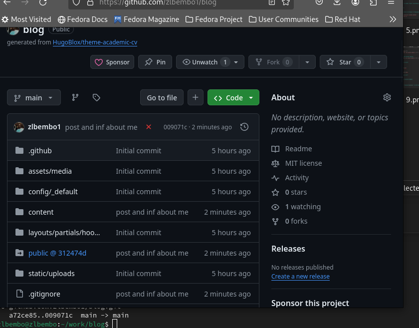

---
## Front matter
lang: ru-RU
title: Отчет по выполнению индивидуального проекта №2
subtitle: Операционные системы
author:
  - Бембо жозе лумингу
institute:
  - Российский университет дружбы народов, Москва, Россия

date: 21 марта 2024

## i18n babel
babel-lang: russian
babel-otherlangs: english

## Formatting pdf
toc: false
toc-title: Содержание
slide_level: 2
aspectratio: 169
section-titles: true
theme: metropolis
header-includes:
 - \metroset{progressbar=frametitle,sectionpage=progressbar,numbering=fraction}
 - '\makeatletter'
 - '\beamer@ignorenonframefalse'
 - '\makeatother'
---

## Докладчик

:::::::::::::: {.columns align=center}
::: {.column width="70%"}

  * Бембо лумингу жозе
  * студент из группы НКАбд-01-23
  * Факультет физико-математических и естественных наук
  * Российский университет дружбы народов
  * [1032229273@rudn.ru](mailto:1032229273@rudn.ru)
  * <https://github.com/zlbembo1>

:::
::: {.column width="30%"}
:::
::::::::::::::

## Цель работы

Продолжить работы со своим сайтом. Редактировать его в соответствии с требованиями. Добавить данные о себе.

## Задание

1. Разместить фотографию владельца сайта.
2. Разместить краткое описание владельца сайта (Biography).
3. Добавить информацию об интересах (Interests).
4. Добавить информацию от образовании (Education).
5. Сделать пост по прошедшей неделе.
6. Добавить пост на тему управление версиями. Git.

## Теоретическое введение

Hugo — генератор статических страниц для интернета.

**Коротко: что такое статические сайты**
    1. Статические сайты состоят из уже готовых HTML-страниц.
    2. Эти страницы собираются заранее, а не готовятся для пользователя «на лету». Для этого используют генераторы статичных сайтов.
    3. Так как это почти чистый HTML, то такие сайты быстрее загружаются и их проще переносить с сервера на сервер.
    4. Минус: если нужно что-то обновить на странице, то сначала это правят в исходном файле, а потом запускают обновление в генераторе.
    5. Ещё минус: такие страницы не подходят для интернет-магазинов или сайтов с личным кабинетом, потому что в статике нельзя сформировать страницу для каждого отдельного пользователя.

## Выполнение лабораторной работы

Добавил свою фотографию в папку blog/content/authors/admin, удалил фотографию шаблона

## Выполнение лабораторной работы

В файле index.md в той же папке изменяю поля. Начинаю с библиографии. Изменила интересы на свои.
Добавил свое образование.
Обновил личные данные, чтобы они были про меня.

## Выполнение лабораторной работы

Проверил, что на локальном сайте все есть. Локальный сайт запускается с помощью hugo server

## Выполнение лабораторной работы

Создаю папки в директории post, которые обозначают посты и в которых будут тексты постов, картинки и доп. файлы

## Выполнение лабораторной работы

Заполнил файл index.md в post1, это пост про прошедшую неделю

## Выполнение лабораторной работы

Закрываю локальный сервер. Генерирую сайт с изменениями

## Выполнение лабораторной работы

Сохраняю изменения на гите

## Выполнение лабораторной работы

Сохраняю изменения в папке, изменения в которйо отправятся на репозиторий, где лежит сайт

## Выполнение лабораторной работы

Проверил, как выглядит сайт в браузере

## Выводы

В процессе выполнения второго этапа индивидуального проекта я научилась редактировать данные о себе, а также писать посты и добавлять их на сайт.
